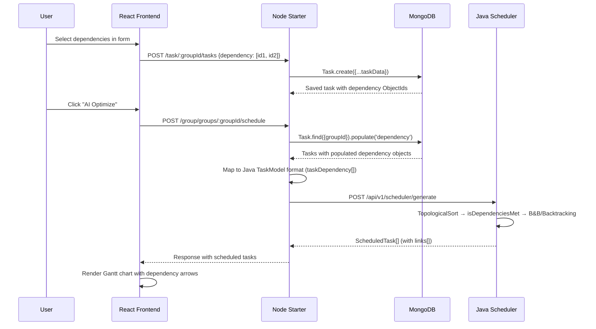

# Task Dependency — Full-Stack Implementation Plan

> **Goal:** Surface the existing dependency support in the Java scheduler (topological ordering, `isDependenciesMet`, locked/unlocked weightage) through the Node service and React frontend so users can define task dependencies and the algorithm correctly respects them.

---

## Architecture Overview

```mermaid
graph LR
    subgraph Frontend["React Frontend (Vite)"]
        A["groupView.jsx<br/>Task Create/Edit Form"] -->|dependency IDs| B["api.js<br/>taskSERVICES"]
        C["SchedulerPanel.jsx"] -->|formatted tasks<br/>with deps| D["api.js<br/>groupService.scheduleTasks"]
        E["GanttChart.jsx"] -->|dependency arrows| F["Visualization"]
    end
    subgraph Node["Node Starter Service"]
        G["Task Model<br/>(Mongoose)"] -->|populate| H["Task Controller"]
        H -->|dependency ObjectIds| I["Schedule Mapper<br/>(groups.js)"]
    end
    subgraph Java["Java Scheduler Service"]
        J["TaskModel.taskDependency"] --> K["TopologicalOrderServiceImpl"]
        J --> L["BacktrackingScheduler<br/>BranchAndBoundScheduler"]
        L -->|isDependenciesMet| M["ScheduledTask<br/>(with links[])"]
    end

    B -->|POST/PATCH with dependency[]| H
    I -->|POST /generate<br/>taskDependency populated| J
    M -->|response with links[]| D
```

---

## Current State Analysis

| Layer | Dependency Support | Gap |
|-------|-------------------|-----|
| **Java Scheduler** | ✅ Full — `TaskModel.taskDependency`, topological sort, `isDependenciesMet()` in both algorithms, `getUnLockedTaskWeigt()`, `ScheduledTask.links[]` | None |
| **Node Model** | ✅ Partial — `dependency: [ObjectId ref: "Task"]` exists in [tasks.js](file:///d:/TASK_MANAGER%20-%20Copy/starter/models/tasks.js#L26-L31) | Not populated when fetched; not mapped to Java `taskDependency` in [scheduleGroupTasks](file:///d:/TASK_MANAGER%20-%20Copy/starter/controlers_Task/groups.js#L125-L205) (hardcoded `taskDependency: []`) |
| **Node Controller** | ⚠️ Generic `Task.create({...taskData})` accepts dependencies but never validates | No circular dependency check, no cascade cleanup on delete |
| **Frontend** | ❌ No UI — form has no dependency picker; `SchedulerPanel` sends `taskDependency: []`; `GanttChart` ignores `links[]` | Full build required |

---

## Phase 1 — Node.js Starter Service

### 1.1 Populate Dependencies on Fetch

**File:** [controlers_Task/tasks.js](file:///d:/TASK_MANAGER%20-%20Copy/starter/controlers_Task/tasks.js)

**Change `getAllTaskks`** to populate the `dependency` field:

```diff
- const tasks = await Task.find({ groupId: groupId });
+ const tasks = await Task.find({ groupId: groupId })
+     .populate('dependency', '_id name priority estimated_duration deadline completed');
```

> [!IMPORTANT]  
> The `.populate()` call resolves ObjectIDs into mini task objects. This is what the frontend needs to show dependency labels and what the scheduler mapper needs to build `taskDependency`.

### 1.2 Validate Dependencies on Create/Update

**File:** [controlers_Task/tasks.js](file:///d:/TASK_MANAGER%20-%20Copy/starter/controlers_Task/tasks.js)

Add validation in `createtask` and `updatetask`:

```js
// Validate dependency IDs exist and belong to the same group
if (taskData.dependency && taskData.dependency.length > 0) {
    const depTasks = await Task.find({
        _id: { $in: taskData.dependency },
        groupId: groupId
    });
    if (depTasks.length !== taskData.dependency.length) {
        return res.status(400).json({ msg: "One or more dependency tasks not found in this group" });
    }
}
```

### 1.3 Cascade Cleanup on Delete

**File:** [controlers_Task/tasks.js](file:///d:/TASK_MANAGER%20-%20Copy/starter/controlers_Task/tasks.js)

When a task is deleted, remove it from the `dependency` arrays of other tasks:

```diff
  const task = await Task.findByIdAndDelete(taskId);
  if (!task) {
       return res.status(404).json({ msg: "Task not found" });
  }
+ // Remove this task from all dependency arrays in the same group
+ await Task.updateMany(
+     { groupId, dependency: taskId },
+     { $pull: { dependency: taskId } }
+ );
```

### 1.4 Map Dependencies in Scheduler Payload

**File:** [controlers_Task/groups.js — scheduleGroupTasks](file:///d:/TASK_MANAGER%20-%20Copy/starter/controlers_Task/groups.js#L125-L205)

This is the **critical fix**. Currently hardcoded to `taskDependency: []`.

```diff
- const tasks = await Task.find({ groupId });
+ const tasks = await Task.find({ groupId })
+     .populate('dependency', '_id name priority estimated_duration deadline completed');

  // ... existing mapping code ...

  const formattedTasks = tasks.map(t => {
      // ... existing fields ...
      return {
          taskId: t._id.toString(),
          name: t.name,
          // ... other fields ...
-         taskDependency: [],
+         taskDependency: (t.dependency || []).map(dep => ({
+             taskId: dep._id.toString(),
+             name: dep.name,
+             priority: dep.priority || "Medium",
+             estimated_duration: dep.estimated_duration || 30,
+             deadline: /* same relative deadline logic */,
+             taskDependency: [],  // Only 1 level deep needed for the algorithm
+             completed: dep.completed || false,
+             userId: 1,
+             userName: "User",
+             groupId: groupId.toString()
+         })),
          userId: 1,
          userName: "User",
          groupId: groupId.toString()
      };
  });
```

> [!WARNING]  
> The Java `isDependenciesMet()` method checks `dependency.getTaskId()` against `completedTaskIds`. The `taskId` field in each dependency object **must** match the `taskId` of the corresponding top-level task in the `tasks[]` array. Using `_id.toString()` ensures this.

---

## Phase 2 — Frontend: Task Create/Edit Form with Dependency Picker

### 2.1 Add Dependency Picker to Create Task Modal

**File:** [temp/groupView.jsx](file:///d:/TASK_MANAGER%20-%20Copy/FRONTEND/temp/groupView.jsx#L378-L422)

Add a multi-select dependency picker inside the task creation form. The picker should:

1. Show all existing tasks in the current group (from `tasks` state)
2. Allow selecting multiple tasks as dependencies
3. Show selected dependencies as removable chips
4. Filter out the current task being edited (for edit mode)

```jsx
// New state in GroupsView component
const [selectedDeps, setSelectedDeps] = useState([]);
const [depSearchQuery, setDepSearchQuery] = useState('');

// Filtered available tasks for dependency picker
const availableDeps = tasks
    .filter(t => !selectedDeps.includes(t._id))
    .filter(t => t.name.toLowerCase().includes(depSearchQuery.toLowerCase()));
```

**UI Design — Dependency Picker Section** (inserted after the "Estimated Span" field):

```jsx
{/* Dependency Links Section */}
<div className="space-y-3">
    <label className="text-[10px] font-black uppercase text-slate-500 ml-1 flex items-center gap-2">
        <Link2 className="w-3.5 h-3.5" />
        Dependency Chain
    </label>
    
    {/* Selected Dependencies as Chips */}
    <div className="flex flex-wrap gap-2 min-h-[3rem]">
        {selectedDeps.map(depId => {
            const depTask = tasks.find(t => t._id === depId);
            return (
                <span key={depId} className="...chip-styles...">
                    {depTask?.name}
                    <button onClick={() => removeDepFromSelection(depId)}>
                        <X className="w-3 h-3" />
                    </button>
                </span>
            );
        })}
    </div>
    
    {/* Searchable Dropdown */}
    <input 
        placeholder="Search tasks to add as dependency..."
        value={depSearchQuery}
        onChange={(e) => setDepSearchQuery(e.target.value)}
    />
    
    {/* Dropdown Results */}
    {depSearchQuery && (
        <div className="...dropdown-styles...">
            {availableDeps.map(t => (
                <button key={t._id} onClick={() => addDepToSelection(t._id)}>
                    {t.name} — {t.priority}
                </button>
            ))}
        </div>
    )}
</div>
```

### 2.2 Wire Dependencies into Form Submission

```diff
  const onSubmit = async (data) => {
      try {
-         await taskSERVICES.createTASK(id, { ...data, name: data.name.trim() });
+         await taskSERVICES.createTASK(id, {
+             ...data,
+             name: data.name.trim(),
+             dependency: selectedDeps  // Array of ObjectId strings
+         });
          setShowForm(false);
          reset();
+         setSelectedDeps([]);
          fetchTasks();
      }
  };
```

### 2.3 Client-Side Circular Dependency Detection

Before submission, detect if adding a dependency would create a cycle:

```js
const wouldCreateCycle = (taskId, newDepId, allTasks) => {
    // BFS/DFS from newDepId — if we can reach taskId, it's a cycle
    const visited = new Set();
    const queue = [newDepId];
    
    while (queue.length > 0) {
        const current = queue.shift();
        if (current === taskId) return true;
        if (visited.has(current)) continue;
        visited.add(current);
        
        const task = allTasks.find(t => t._id === current);
        if (task?.dependency) {
            for (const dep of task.dependency) {
                const depId = typeof dep === 'object' ? dep._id : dep;
                queue.push(depId);
            }
        }
    }
    return false;
};
```

### 2.4 Show Dependencies on Task Cards

**File:** [temp/groupView.jsx](file:///d:/TASK_MANAGER%20-%20Copy/FRONTEND/temp/groupView.jsx#L293-L347)

Add a dependency indicator on each task card:

```jsx
{/* Inside the task card, after description */}
{task.dependency && task.dependency.length > 0 && (
    <div className="flex items-center gap-2 mt-3">
        <Lock className="w-3 h-3 text-amber-500" />
        <span className="text-[10px] text-amber-500 font-bold">
            Blocked by {task.dependency.length} task(s)
        </span>
    </div>
)}
```

---

## Phase 3 — Frontend: Scheduler Panel Updates

### 3.1 SchedulerPanel — Pass Dependencies to Direct API

**File:** [SchedulerPanel.jsx](file:///d:/TASK_MANAGER%20-%20Copy/FRONTEND/src/components/task-manager/SchedulerPanel.jsx#L23-L31)

If using the direct scheduler API (not through Node `scheduleGroupTasks`), update the task mapping:

```diff
  const formattedTasks = tasks.map(t => ({
      taskId: t._id || Math.floor(Math.random() * 1000000),
      name: t.name,
      priority: t.priority || "medium",
      estimated_duration: t.duration || t.estimated_duration || 2,
      deadline: t.deadline || 24,
-     taskDependency: []
+     taskDependency: (t.dependency || []).map(dep => ({
+         taskId: typeof dep === 'object' ? dep._id : dep,
+         name: typeof dep === 'object' ? dep.name : 'Unknown',
+         priority: typeof dep === 'object' ? dep.priority : 'Medium',
+         estimated_duration: typeof dep === 'object' ? dep.estimated_duration : 30,
+         deadline: 24,
+         taskDependency: [],
+         completed: false,
+         userId: 1,
+         userName: "User",
+         groupId: ""
+     }))
  }));
```

### 3.2 Add Dependency Multiplier Slider

Add a third slider in the configuration section of `SchedulerPanel.jsx`:

```jsx
<div>
    <label className="block text-xs font-bold text-gray-500 uppercase mb-2">Dependency Focus</label>
    <input 
        type="range" min="0.5" max="5" step="0.5"
        value={policy.dependencyMultiplier || 1.0}
        onChange={(e) => setPolicy({...policy, dependencyMultiplier: parseFloat(e.target.value)})}
        className="w-full accent-amber-500"
    />
    <div className="flex justify-between text-[10px] text-gray-500 mt-1">
        <span>Flexible</span>
        <span>Chain Weight: {policy.dependencyMultiplier || 1.0}x</span>
    </div>
</div>
```

---

## Phase 4 — Gantt Chart Dependency Arrows

### 4.1 Render Dependency Links in GanttChart

**File:** [GanttChart.jsx](file:///d:/TASK_MANAGER%20-%20Copy/FRONTEND/src/components/task-manager/GanttChart.jsx)

Use SVG lines/arrows to connect dependent tasks:

```jsx
{/* After rendering task bars, overlay an SVG for dependency arrows */}
<svg className="absolute inset-0 pointer-events-none" style={{ width: '100%', height: '100%' }}>
    {scheduledTasks.map(task => 
        (task.links || []).map(depId => {
            const depTask = scheduledTasks.find(t => t.id === depId);
            if (!depTask) return null;
            
            const fromX = (depTask.endTime / maxTime) * 100;
            const fromY = /* row index of depTask */ ;
            const toX = (task.startTime / maxTime) * 100;
            const toY = /* row index of task */ ;
            
            return (
                <line
                    key={`${depId}-${task.id}`}
                    x1={`${fromX}%`} y1={fromY}
                    x2={`${toX}%`} y2={toY}
                    stroke="#f59e0b"
                    strokeWidth="2"
                    markerEnd="url(#arrowhead)"
                />
            );
        })
    )}
    <defs>
        <marker id="arrowhead" markerWidth="10" markerHeight="7" refX="10" refY="3.5" orient="auto">
            <polygon points="0 0, 10 3.5, 0 7" fill="#f59e0b" />
        </marker>
    </defs>
</svg>
```

### 4.2 GroupView — Show Dependencies in Optimized Timeline

**File:** [temp/groupView.jsx](file:///d:/TASK_MANAGER%20-%20Copy/FRONTEND/temp/groupView.jsx#L268-L289)

Add a small dependency indicator in the scheduled task cards:

```jsx
{/* Inside the scheduled task card */}
{st.links && st.links.length > 0 && (
    <div className="mt-4 flex items-center gap-2">
        <Lock className="w-3 h-3 text-amber-400" />
        <span className="text-[8px] font-black uppercase tracking-widest text-amber-400">
            {st.links.length} prerequisite(s)
        </span>
    </div>
)}
```

---

## Data Flow Summary



---

## File Change Summary

| File | Changes |
|------|---------|
| [starter/controlers_Task/tasks.js](file:///d:/TASK_MANAGER%20-%20Copy/starter/controlers_Task/tasks.js) | Populate deps on fetch, validate on create/update, cascade delete |
| [starter/controlers_Task/groups.js](file:///d:/TASK_MANAGER%20-%20Copy/starter/controlers_Task/groups.js) | Populate deps in `scheduleGroupTasks`, map to `taskDependency[]` |
| [FRONTEND/temp/groupView.jsx](file:///d:/TASK_MANAGER%20-%20Copy/FRONTEND/temp/groupView.jsx) | Dependency picker in form, dep badges on cards, deps in scheduled view |
| [FRONTEND/src/components/task-manager/SchedulerPanel.jsx](file:///d:/TASK_MANAGER%20-%20Copy/FRONTEND/src/components/task-manager/SchedulerPanel.jsx) | Map populated deps, add dependency multiplier slider |
| [FRONTEND/src/components/task-manager/GanttChart.jsx](file:///d:/TASK_MANAGER%20-%20Copy/FRONTEND/src/components/task-manager/GanttChart.jsx) | SVG dependency arrows using `links[]` from response |

---

## Risk & Validation Notes

> [!CAUTION]
> **Circular Dependencies:** The Java `TopologicalOrderServiceImpl` throws a `RuntimeException("Circular dependency detected in tasks!")` on cycles. Both the Node service and frontend must validate before data reaches Java. Add client-side BFS check (Phase 2.3) and server-side validation.

> [!WARNING]
> **Deep Nesting:** The Java `TaskModel` has `List<TaskModel> taskDependency` which is recursive. Only map **1 level deep** from Node — the algorithm only needs `dependency.getTaskId()` to check against `completedTaskIds`. Deeply nested objects would bloat the payload.

> [!NOTE]
> **No Java Changes Required:** The scheduler already fully supports dependencies. The `isDependenciesMet()`, topological ordering, and locked/unlocked weightage calculations are all implemented. This plan is purely Node + Frontend work.
